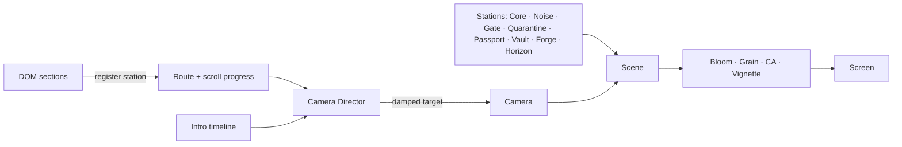
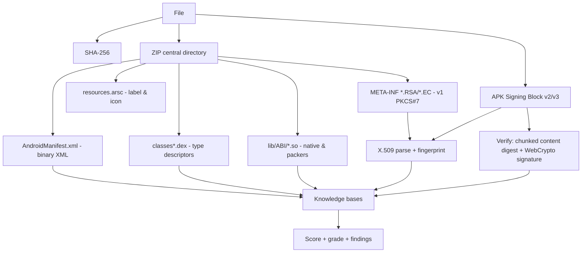

# VICZO STORE — Remaster Master Plan

> **Codename:** `SIGNAL`
> **One line:** An app & website store that **X-rays every APK and every link before you touch it**, wrapped in a cinematic 3D world that tells that story.

---

## TL;DR (Hinglish)

- Purana VICZO ek simple APK + website directory tha (light theme, 2.8s text intro, fake upload box). Build bhi toot raha tha (`src/data/mockData.ts` missing tha).
- Naya VICZO ek **real problem solve karta hai**: bahar se download kiye gaye APK aur scam links (fake KYC, loan apps, "mod APK", look-alike domains) se log hack hote hain. VICZO ka **Sentinel** engine APK ko **aapke browser ke andar hi** khol ke dikhata hai — permissions, trackers, signature, certificate, SHA-256 — aur ek **Trust Score** deta hai. File kahin upload nahi hoti.
- Links ke liye **Link X-ray**: punycode/homograph (`аpple.com` with Cyrillic "а"), typo-squatting, fake subdomains, shady TLDs — sab offline check.
- Website ek **story** hai: *Noise → Ember & Tide → Fusion → Sentinel → Vault → Forge → Horizon*. Intro ek 16-second 3D film hai (do energy "dragons" takraate hain, crystal core banta hai, laser scan se fake packets toot'te hain, particles se VICZO naam banta hai, aur camera bina cut ke website mein land karta hai).
- Ending: footer mein ek "credits" portal — end.mp4 jaisa fire + laser slice — "Crafted by Yashraj Ghemud".

---

## 0. Contents

1. [Analysis of the original](#1-analysis-of-the-original)
2. [The real-world problem](#2-the-real-world-problem)
3. [Product concept & pillars](#3-product-concept--pillars)
4. [Story bible](#4-story-bible)
5. [Intro film — shot-by-shot script](#5-intro-film--shot-by-shot-script)
6. [The website as a story — scroll chapters](#6-the-website-as-a-story--scroll-chapters)
7. [Page specs](#7-page-specs)
8. [Visual, motion & sound language](#8-visual-motion--sound-language)
9. [Architecture](#9-architecture)
10. [Sentinel engine spec](#10-sentinel-engine-spec)
11. [Data model & security rules](#11-data-model--security-rules)
12. [Performance, accessibility & fallbacks](#12-performance-accessibility--fallbacks)
13. [Honest limitations](#13-honest-limitations)
14. [Build order & iteration log](#14-build-order--iteration-log)

---

## 1. Analysis of the original

**What it was:** React 19 + Vite + Tailwind v4 + Framer Motion + Firebase (Auth + Firestore). A directory of Android APKs and websites with realtime lists, detail pages and a Google-sign-in upload form.

| Area | What existed | Problems found |
| --- | --- | --- |
| Intro | 2.8 s DOM text reveal ("VICZO / STORE", two lines drawing, glow blob) | Pretty but generic; no story; no 3D; ended with a plain fade |
| Background | 2D canvas particle network, click shockwave | O(n²) connection loop every frame; no meaning |
| Home | Hero, count-up stats, tabs, category chips, grid, CTA | Stats were hard-coded fiction (12,400 uploads, 4.2M downloads); **category chips did nothing**; search box did nothing |
| Detail pages | Icon, rating, fake download progress, screenshots, lightbox | "Download" never downloaded anything (fake 5%/100 ms progress); `Badge variant="verified"` not defined |
| Upload | Metadata form + drag-drop box | Drop box was decorative — no file was read; size was `Math.random()` |
| Data | Firestore `apps`, `websites` | Types imported from **`src/data/mockData.ts`, which does not exist → the project does not build** |
| Errors | `handleFirestoreError` copied into 4 files | Throws JSON containing the user's **email, uid, provider data** into the UI (PII leak) |
| UI kit | shadcn-style Button/Badge/Card | Uses tokens (`bg-primary`, `text-primary-foreground`, …) that are never defined → unstyled |
| Assets | `start.mp4` (neon red & blue dragons clash → fused "LETVLER" logo), `end.mp4` (lava portal, name forged in fire, vertical laser slice) | Unused in code — they are **style references** for the remaster |

**What we keep:** the name, the "Apps & Sites, All in One Place" promise (evolved), the terracotta ember colour (`#c17b50` becomes the deep end of the Ember ramp), Outfit as the body font, the thin horizontal line that opened the old intro (it now opens the new one), Firebase Auth + Firestore, the spinning conic border on the nav.

---

## 2. The real-world problem

People install apps from outside official stores every day — "mod APKs", regional apps not on Play, apps shared on WhatsApp/Telegram, apps from a link in an SMS. That is also the main road for Android malware:

- **Banking trojans** draw fake login screens *over* real banking apps (overlay attack) and read OTP SMS.
- **Predatory loan apps** harvest contacts, call logs and photos, then use them for harassment.
- **Spyware / stalkerware** hides its launcher icon and records mic, location and messages.
- **Droppers** look clean at install time and download the real payload later (dynamic code loading).
- **Repackaged apps** take a popular app, inject code, and re-sign it with a different key.
- **Phishing links** ("your KYC expires today", "electricity bill unpaid", "reward points expiring") lead to pixel-perfect clones on look-alike domains — sometimes using **homographs** like `аpple.com` where the first letter is Cyrillic.

Android shows runtime permission prompts, but *before install* an ordinary person cannot see: which trackers are inside, who signed it, whether the signature is valid, whether it was tampered with, or whether the permission *combination* is the classic banker toolkit. And nobody decodes a punycode domain in their head.

**VICZO's answer:** a store where every listing ships with a readable **Trust Passport**, plus a free lab where *anyone* can X-ray *any* APK or link — **on their own device, without uploading anything**.

---

## 3. Product concept & pillars

**Positioning:** *See inside every app before it sees inside you.*

| Pillar | What it is | Real value |
| --- | --- | --- |
| **Sentinel · APK X-ray** | Drop an APK → unzipped and analysed in a Web Worker in the browser: manifest (binary XML), permissions, components, SDK levels, DEX class scan (trackers, dynamic code loading, SMS/overlay/accessibility APIs, packers), native libs, APK Signing Block v2/v3 + v1 JAR signature, certificate details, **cryptographic signature verification**, SHA-256. | Pre-install transparency with zero privacy cost |
| **Link X-ray** | Paste a URL → offline heuristics: punycode decode + mixed-script/confusable detection, brand typo-squats (`paypa1`, `g00gle`, `rn`→`m`), brand-in-subdomain tricks (`sbi.co.in.kyc-update.top`), abused TLDs, IP hosts, `@` userinfo trick, shorteners, raw APK downloads, scam keywords (KYC, refund, reward, OTP…) | Catches the SMS/WhatsApp scams people actually get |
| **Trust Passport** | A "nutrition label for software" on every listing: score, grade, plain-language permissions, trackers, signature, certificate fingerprint, SHA-256, flags | Rank by trust, not hype |
| **Verify Download** | Drop the file you downloaded → Sentinel compares SHA-256 and signing-certificate fingerprint against the listing's passport | Detects tampering / repackaging: "if a single byte changes, you'll know" |
| **The Forge · Publish with proof** | Developers drop their APK → passport generated → metadata auto-filled (package, version, label, SDKs) → listing goes live with its fingerprint | Developer identity = signing certificate |

---

## 4. Story bible

The website is one continuous world. Every page is a *place* in it; navigating is flying the camera.

| Element | Meaning | Look |
| --- | --- | --- |
| **THE NOISE** | The open internet: endless apps and links, no one checking | A slow vortex of floating app tiles (procedural glyph icons). Some tiles **glitch red** — the masks |
| **EMBER** | The makers of apps | A serpent of warm fire (orange → terracotta), dragon-like ribbon with sparks — homage to the red dragon in `start.mp4` |
| **TIDE** | The builders of the web | A serpent of cool light (cyan → teal) — the blue dragon |
| **FUSION** | Apps + sites meeting in one place (the original tagline, made literal) | White-violet flash, shockwave, time slows |
| **THE CORE** | VICZO itself | A faceted refractive crystal with an ember/tide plasma heart, orbited by rings of verified tiles |
| **THE SENTINEL** | The scanner | A razor-thin laser plane — homage to the vertical laser in `end.mp4` |
| **THE VAULT** | The catalog | Calm, ordered, lit |
| **THE FORGE** | Where developers publish | Ember sparks, an anvil ring |
| **THE HORIZON** | The ending / credits | A portal ring with lava cracks — homage to `end.mp4` |

**Colour story:** Ember (orange) + Tide (teal) is the classic Hollywood *teal & orange* grade — the brand palette *is* a cinematic grade. Fusion violet only appears when they meet.

**Voice:** short, calm, confident. The Sentinel "speaks" in monospace HUD log lines (`SENTINEL › 143 MASKS DETECTED`). No fake statistics anywhere — every number on screen is either computed live or clearly a label.

---

## 5. Intro film — shot-by-shot script

Total ≈ 16 s after the gate. 2.39:1 letterbox bars are in place from the first frame and retract at the handoff. The world clock (simulation) is separate from the camera clock so we can do real **bullet time**.

### SHOT 00 — THE GATE (preloader, waits for the user)
- Black. The old intro's thin horizontal line draws from centre outward (continuity with v1).
- A single ember point breathes at centre (it *is* the point of Shot 01 — no cut later).
- Mono readout: `VICZO / SENTINEL — ASSEMBLING THE WORLD 000 → 100` (real progress: fonts + shader warm-up + world build).
- Choice: **[ ENTER WITH SOUND ]  [ ENTER IN SILENCE ]** · `skip intro`.
- Why a gate: browsers block autoplay audio; the gate also gives a clean start.

### SHOT 01 — PULSE (0.0 → 1.8 s)
- **Camera:** 6 → 4.5 units slow push-in; handheld micro-drift (2-octave noise, 0.02 u), roll ±0.3°.
- **Action:** the point beats twice (lub-dub), bloom swelling with each beat.
- **Caption (typed, mono, bottom-left):** "Every day, people install apps from places nobody checks."
- **Sound:** two sub-bass heartbeats; room tone.

### SHOT 02 — THE NOISE (1.8 → 4.6 s)
- **Action:** the point bursts; ~1,500 app tiles explode outward and settle into a turning vortex. ~12 % are *masks*: red flicker, vertex glitch, RGB split.
- **Camera:** **dolly-zoom (Vertigo)** — dolly back 4.5 → 28 u while FOV opens 20° → 62°; the world "unfolds" around the viewer.
- **HUD (top-right):** `PACKETS IN RANGE 1,512` (live count).
- **Caption:** "Most are harmless. Some wear a mask."
- **Sound:** whoosh, glitch crackles.

### SHOT 03 — TWO FIRES (4.6 → 7.6 s)
- **Action:** EMBER enters lower-left, TIDE upper-right — glowing ribbon serpents with hot heads, tapered scaled bodies and spark trails. They spiral around the vortex in a double helix.
- **Camera:** orbits 0° → 70° around the centre, tracking the serpents' midpoint, gentle roll ±4°.
- **HUD tags follow the heads (projected):** `EMBER — the makers of apps` / `TIDE — the builders of the web`.
- **Sound:** two risers panned L/R (warm saw vs cool sine).

### SHOT 04 — BREATH & FUSION (7.6 → 9.6 s)
- **Action:** the serpents turn head-to-head and breathe energy cones (homage to the dragons' fireballs in `start.mp4`). The cones meet → **FUSION**: white-violet flash, expanding shockwave ring, chromatic aberration spike, camera shake impulse.
- **Bullet time:** simulation slows to 0.15× for 0.6 s while the camera keeps moving at 1× — sparks hang in the air — then ramps back.
- **The Core crystallises** from the flash (scale 0 → 1 with a soft elastic overshoot).
- **Caption:** "When they meet—"
- **Sound:** reverse swell → sub boom + crash with a long generated-reverb tail.

### SHOT 05 — THE SENTINEL (9.6 → 12.0 s)
- **Action:** the Core ignites a laser plane that sweeps top → bottom through the storm. Every tile it crosses is judged:
  - clean → re-coloured ember (apps) or tide (sites) and flies into orbit-ring slots around the Core;
  - mask → a red reticle snaps on it, then it **shatters** into shards with real ballistic motion (velocity, spin, gravity, drag, fade).
- **Camera:** crane down following the laser, settling in front of the Core.
- **HUD:** `MASKS DETECTED 0 → 181` · `SENTINEL: SWEEPING → CLEAR`.
- **Caption:** "—nothing stays hidden."
- **Sound:** laser hum panned with the sweep; small pops per shatter (rate-limited).

### SHOT 06 — THE NAME (12.0 → 14.4 s)
- **Action:** ~6,000 particles (from the storm and the shards) converge into **VICZO**, sampled from the display font. The letters burn with an ember → violet → tide gradient (homage to the flaming gradient logo in `start.mp4`), flames licking upward.
- A **vertical blade of light slices through the name** left → right with a flash and spark burst (homage to `end.mp4`).
- "STORE" tracks in, letter-spacing collapsing (homage to the original v1 intro).
- **Tagline:** "Apps & Sites. X-rayed. All in one place."
- **Sound:** shimmer chord, blade "zing", final low hit.

### SHOT 07 — ARRIVAL (14.4 → 16.0 s) — the intro's ending
- **Action:** the title dissolves upward and is inhaled by the Core like embers. The storm calms to an ambient drift.
- **Camera:** crane up + 25° orbit into the exact homepage hero framing (Core right of centre on desktop, top-centre on mobile). **No cut: the last frame of the film is the first frame of the website.**
- **UI assembles:** letterbox bars retract (top up, bottom down), the nav drops in on a spring, the headline rises character by character, CTAs pop.
- Scroll unlocks.

### Variants
- **Returning visitor:** 2.5 s "re-entry" (pulse → fusion flash → Core → arrival). Full film via *Replay intro* in the footer, the command palette, or `/intro`.
- **`prefers-reduced-motion`:** no film; a 600 ms fade to the hero.
- **No WebGL:** 2D fallback title card, then the site with a static gradient world.

---

## 6. The website as a story — scroll chapters

On the home page, scroll position drives the camera through the world along a Catmull-Rom spline between station cameras; every section "owns" a station so the camera lands exactly when its section is centred. Lenis smooth-scroll + damped camera = soft, heavy, cinematic motion.

| # | Section | Camera station | DOM content |
| --- | --- | --- | --- |
| 0 | **Hero — The Core** | Core, framed right | "See inside every app **before** it sees inside you." · CTAs *Explore the Vault* / *X-ray an APK* · live counts (listings / scanned) |
| 1 | **The Noise** | Inside the vortex; masks close to lens; CA grows with scroll speed | Six threat cards (banking trojan, loan-app harvester, stalkerware, dropper, repackaged "mod", phishing homograph) each with *"what Sentinel checks"* |
| 2 | **The Sentinel** | The laser gate; sticky, scroll-scrubbed | 5 stages: Unpack → Read the manifest → Trace the code → Check the seal → Score. Privacy promise: *0 bytes uploaded* |
| 3 | **Quarantine** (interactive) | Glass chamber with real rigid-body physics | "Tap a package to scan it" — clean ones levitate out, masks shatter. Score counter. Labelled *simulation* |
| 4 | **The Passport** | A 3D passport card turning with scroll | Anatomy of a Trust Passport + *Verify Download* explained |
| 5 | **The Vault** | Calm library wall of tiles | The catalog: Apps/Sites tabs, fuzzy search, working category filters, sort by Trust/Newest/Name, 3D tilt cards with trust rings |
| 6 | **The Forge** | Ember anvil ring | "Publish with proof" — 4 steps → `/upload` |
| 7 | **Horizon — Credits** (the site's ending) | Portal ring | Giant outline VICZO, "Crafted by Yashraj Ghemud" forged in fire with a laser slice, *Replay the intro*, links |

---

## 7. Page specs

### `/` Home — see §6.

### `/scan` — Sentinel Lab
- Tabs: **APK X-ray** · **Link X-ray** · **Verify a download**.
- The whole page is a drop target ("release to X-ray").
- Cinematic: the file becomes a package cube that drops into the scan chamber, scan rings sweep it, then it separates into an **exploded view of its real ZIP composition** (DEX / native / resources / assets / manifest / signatures, sized by bytes); findings rise as tags; the score assembles.
- Report: verdict + score + reasons · identity (package, version, SDKs, size, SHA-256) · signature (schemes, verified?, certificate subject/issuer/validity/algorithm/key size, SHA-256 fingerprint, debug-key warning) · permissions grouped with plain language + detected combos · trackers · code signals · components (exported without permission) · manifest flags · composition bar · export JSON.
- **Samples** (no APK at hand?): two *synthetic* APKs generated at build time and shipped in `public/samples/` — a harmless "notes" app and an inert "banker-like" sample whose manifest/DEX *references* trigger the heuristics. Clearly labelled; they contain no executable logic.
- Link X-ray shows the decoded host with confusable characters highlighted.

### `/app/:slug` · `/website/:slug` — Detail
- Hero with the listing's icon on a 3D monolith, Trust Passport ring, download/visit.
- **Download flow:** passport summary first → download from the publisher's link → *Verify your download* drop zone right there.
- **Visit flow (sites):** interstitial with the decoded destination and Link X-ray verdict.
- Screenshots as a draggable 3D cover-flow; about, tags, technical info.

### `/upload` — The Forge
- Choose App or Website → for apps, drop the APK → Sentinel autofills package, version, label, SDKs → developer adds tagline, description, category and an **https download URL** → submit with passport.
- For sites: URL → Link X-ray preview → submit with link report.
- Google sign-in required (as before).

### `/intro` — replays the film, then lands on `/`.
### `*` — **Signal Lost** 404: glitch storm, "This route doesn't exist — or it's wearing a mask."
### Global — floating glass nav (spinning conic border kept from v1), ⌘K command palette, sound toggle, route "iris" transitions while the camera flies between stations.

---

## 8. Visual, motion & sound language

### Palette
| Token | Hex | Use |
| --- | --- | --- |
| obsidian-950 | `#07060a` | page |
| obsidian-900 / 850 | `#0d0b12` / `#14111b` | surfaces |
| ember | `#ff6b2c` (light `#ffb070`, deep `#c17b50`) | apps, primary actions |
| tide | `#29d3ff` (light `#8fe9ff`) | websites, links |
| fusion | `#9b7bff` (light `#d9ccff`) | VICZO moments |
| safe / caution / danger | `#3cf2a0` / `#ffc24a` / `#ff3d5a` | trust states |
| text | `#f4efe9` / `#b9b0a6` / `#7c746c` | warm whites (nod to v1 parchment) |

### Type
- **Unbounded** (display, 700–900, tight tracking) — titles, the particle wordmark.
- **Instrument Serif italic** — poetic accents ("*before* it sees inside you").
- **Outfit** (body, from v1).
- **JetBrains Mono** — HUD, data, hashes.
- All self-hosted via Fontsource (no third-party font requests — on-brand for a privacy product).

### Motion
- Entrances `cubic-bezier(0.16, 1, 0.3, 1)`; wipes `cubic-bezier(0.83, 0, 0.17, 1)`; pops `cubic-bezier(0.34, 1.56, 0.64, 1)`.
- Durations: 160 / 320 / 640 / 1200 ms; cinematic ≥ 2 s.
- **Camera rules:** always critically damped (frame-rate independent), never linear; handheld noise layer; trauma-based shake for impacts; dolly-zoom and bullet time reserved for the film.
- **Post:** bloom (mip-blur), film grain, vignette, chromatic aberration (baseline tiny, spikes on impacts and fast scroll), ACES/AgX tone mapping, exponential fog for depth, near-camera dust particles for parallax.

### Sound (procedural Web Audio — zero audio files)
Heartbeat (55 Hz pitch-drop) · whoosh (band-passed noise sweep) · glitch (crushed noise stutters) · risers (warm saw / cool sine) · impact (noise + 80→30 Hz drop + generated reverb) · laser (FM + filter sweep, panned) · shatter ticks · shimmer chord with feedback delay · blade zing · UI ticks. Off by default; the gate and nav toggle turn it on; preference persisted.

---

## 9. Architecture

```
src/
  app/            App shell, router, providers, page transitions
  world/          ONE persistent <Canvas>: stations, camera director, post-FX
    core/ storm/ serpents/ title/ gate/ vault/ forge/ horizon/ chamber/ shaders/
  intro/          timeline (shots + keyframes), director, overlay (gate, letterbox, captions, HUD)
  audio/          procedural sound engine
  sentinel/       pure-TS analysis engine (worker + client), url/ inspector, knowledge bases
  data/           types, Firestore catalog hooks, demo catalog
  components/     ui primitives (TrustRing, TiltCard, SplitText, Magnetic, CommandPalette…)
  sections/       home chapters
  pages/          Home, Scan, AppDetail, WebsiteDetail, Upload, NotFound, IntroReplay
  state/          zustand stores (experience, world/camera)
scripts/          build-samples.mjs (synthetic sample APKs)
tests/            vitest (AXML, DEX, signing on fixtures, URL inspector, scoring)
docs/             this plan + reference videos
```



**Key decisions**
- **One canvas for the whole app** → the intro's last frame is the site's first frame, and page changes are camera flights, not reloads.
- Stations outside ~45 units of the camera are not rendered.
- Instancing everywhere (tiles, shards, sparks); custom shaders instead of many materials.
- Heavy pieces are lazy: physics (Rapier) only when Quarantine/Chamber is near; the Sentinel worker only when used; routes code-split.
- DOM stays the source of truth for content (SEO, accessibility); the canvas is `aria-hidden`.

---

## 10. Sentinel engine spec



- **Runs in a Web Worker**, streams progress stages to the UI (the 3D cinematic follows real progress).
- **ZIP:** `fflate` for entries; own EOCD/central-directory reader for offsets (needed for the signing block).
- **Binary XML (AXML):** string pool (UTF-8/UTF-16), resource map, start/end element chunks, typed attribute values; falls back to framework attribute resource IDs when attribute names are stripped (obfuscated manifests).
- **resources.arsc:** resolve `@string/app_name` and the launcher icon's highest-density bitmap (best effort).
- **DEX:** header → `string_ids` / `type_ids` → class descriptors (all `classesN.dex`), matched against tracker signatures and API signals.
- **Signing:** find `APK Sig Block 42` before the central directory; parse v2 (`0x7109871a`), v3 (`0xf05368c0`), v3.1 (`0x1b93ad61`) blocks → signers → certificates + public keys + signatures. **Verify** RSA-PKCS#1 / RSA-PSS / ECDSA-P256 signatures over signed-data with WebCrypto and recompute the chunked content digest (1 MiB chunks, `0xa5`/`0x5a` prefixes) — so "verified" means verified. v1: parse PKCS#7 `SignedData` certificate.
- **Knowledge bases:** ~90 permissions (plain-language + severity + weight), ~70 tracker SDK signatures (analytics / ads / attribution / crash / engagement), code signals (DexClassLoader, Runtime.exec, SmsManager, AccessibilityService, DevicePolicyManager, reflection, root & emulator checks), packers (Jiagu, Bangcle, SecNeo, …).
- **Combos (the heart of it):** Banker (accessibility + overlay + SMS) · Harvester (contacts + SMS/call log + media) · Stalker (mic + location + no launcher icon + boot) · Dropper (install packages + dynamic loading) · SMS fraud (send SMS) · Hard-to-remove (device admin) · OTP reader (notification listener).
- **Score:** start at 100, subtract capped weighted penalties (signature problems, combos, dangerous permissions, trackers, flags like `debuggable`, cleartext traffic, old target SDK, exported components). Grade A+…F, verdict *Clean signal / Caution / High risk*, each deduction explained.
- **Link X-ray** (pure, synchronous, offline): WHATWG URL parse → punycode decode → script mixing + confusable skeleton → brand distance (Damerau-Levenshtein on skeletons) → registrable domain via a compact public-suffix subset → TLD / shortener / keyword / structure checks → score + findings.

---

## 11. Data model & security rules

Added to `apps/{id}` (all optional, backwards compatible): `download_url` (https only), `passport { engine, scanned_at, score, grade, verdict, sha256, size_bytes, package_name, version_name, version_code, min_sdk, target_sdk, signature { schemes[], verified, cert_sha256, cert_subject, debug_cert }, permissions[], trackers[], signals[], flags{}, composition{}, findings[] }`.
Added to `websites/{id}`: `link_report { score, verdict, host, unicode_host, findings[] }`.

`firestore.rules` gains type/size validation, https-only URLs, immutable `developer_id`, and a sane size cap. Error handling is centralised and **no longer puts email/uid/provider data into thrown errors**.

---

## 12. Performance, accessibility & fallbacks

| Tier | Detected by | Tiles | Crystal | Post | DPR | Physics |
| --- | --- | --- | --- | --- | --- | --- |
| 3 high | desktop GPU | ~1,500 | transmission glass | full | ≤ 2 | yes |
| 2 mid | default | ~900 | physical glass | bloom + grain | ≤ 1.5 | yes |
| 1 low | mobile / weak GPU / low memory | ~400 | fresnel shader glass | bloom (half-res) | 1 | static |
| 0 none | no WebGL / software renderer | — | — | — | — | — |

Runtime FPS monitoring steps quality down automatically. Reduced-motion users get no film, no shake, no parallax. Everything meaningful is real DOM text; the intro captions are announced via `aria-live`. Keyboard: `Esc` skips the film, `⌘K`/`Ctrl K` opens the palette, visible focus rings everywhere.

---

## 13. Honest limitations

- Sentinel is **static pre-install analysis**, not an antivirus. It cannot see server-side behaviour, code downloaded later, or well-obfuscated logic. Findings are signals with explanations, not verdicts from on high.
- A passport generated in a publisher's browser can be forged by a malicious publisher. That is why **anyone can re-run Sentinel on the actual download** (Verify Download) — mismatches are shown loudly. Roadmap: server-side re-scan (Cloud Function), reproducible-build badges, community reports.
- Link X-ray has no network access by design (privacy); it cannot know domain age or live reputation.

---

## 14. Build order & iteration log

| Iteration | Focus | Exit criteria |
| --- | --- | --- |
| 1 · Foundation | Repo restructure, stack upgrade, design tokens, fonts, data layer (Firestore + demo), shared errors | `npm run build` + `lint` green |
| 2 · Cinema | World canvas, Core, storm, serpents, fusion, laser, particle title, handoff, gate, sound | Screenshot review of every shot |
| 3 · Sentinel | Engine + worker + tests; verified against real APKs | Tests green; real APK signatures verify |
| 4 · Store | Home chapters, Vault, Scan lab, detail pages, Forge, 404, finale | All routes screenshot-reviewed on desktop + mobile |
| 5 · Polish | Perf tiers, reduced motion, a11y, SEO, docs | Lighthouse-style checks, final review |

Each iteration ends with a *critique pass*: screenshots → list what feels weak → fix → repeat. Notes from each pass are appended below.

### Iteration notes
_(appended during the build)_

**Iteration 1 — Foundation & engine.** Engine written first and verified against five real APKs (multidex, native libs, v1+v2+v3 signing): signatures and content digests verify with WebCrypto; the public AOSP test key and debug keys are identified. Anti-emulator/Frida strings appear in legitimate test libraries, so they became zero-weight *info* signals. Synthetic sample APKs were cross-checked with androguard. Added rules for keyboards (offline vs online), VPN services and SMS reading after the demo catalog showed an SMS-reading finance app scoring "clean".

**Iteration 2 — Cinema (screenshot review of every shot).**
- Film grain was applied to HDR values before tone mapping → coloured speckles in the mote. Tone mapping moved directly after bloom.
- Plan said "dolly-zoom on the reveal"; in practice a pull-back + widening FOV reads better for the burst, so the true dolly-zoom (push-in + FOV widening, title holds its size) moved to the name shot.
- Orbit rings passed in front of the particle title → title plane moved to z = 5.4, in front of the rings.
- The blade-slice flash whited out the frame → peak lowered and shortened.
- Hero headline did not reveal after the handoff (in-view observer attached late) → reveal now driven by `useInView` + `animate`.
- Dragon wings read as paper planes → 5 fanned bones with a travelling flap wave.

**Iteration 3 — Chapters.**
- Hero copy sat on busy tiles → legibility scrim; headline re-sized to 4 lines so stats fit above the fold.
- "The Noise" framed the Core behind the heading → station re-aimed outward into the storm.
- Sentinel gate was edge-on behind the text → ¾ camera, gate on the right.
- Offline Firestore cache snapshot was reported as "Live" → only server snapshots count.
- Vault wall made glass cards busy → wall pushed into the fog, cards made more opaque; Forge steps moved left of the anvil.
- Firebase now loads only after the film, so it never competes with the intro.

**Known follow-ups.** Server-side re-scan of submitted APKs (Cloud Function); reproducible-build badges; community reports; an OG image; lighter first-load bundle (three.js + postprocessing ≈ 360 KB gzip, lazy after the gate).
